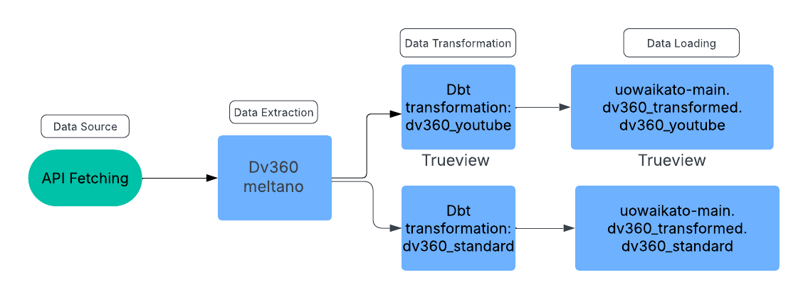
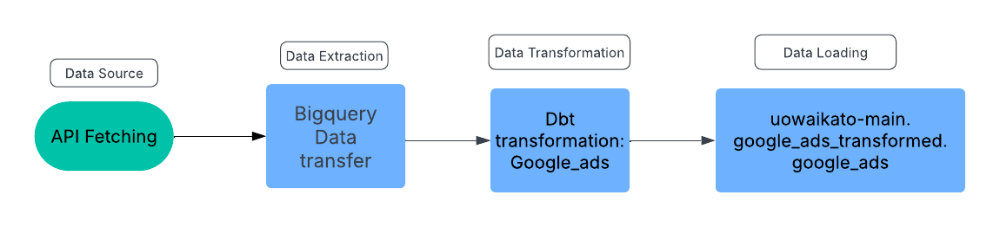
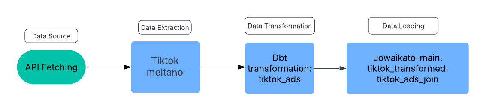
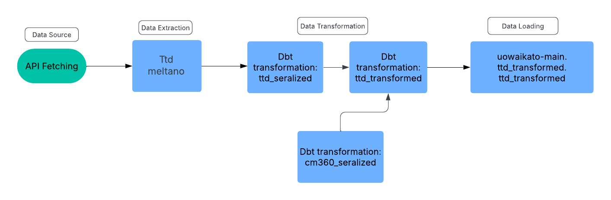
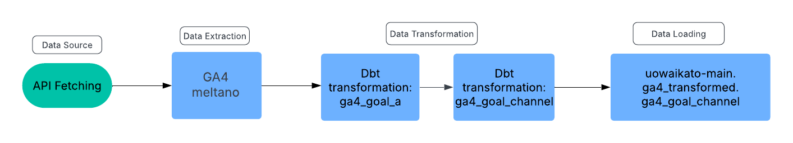
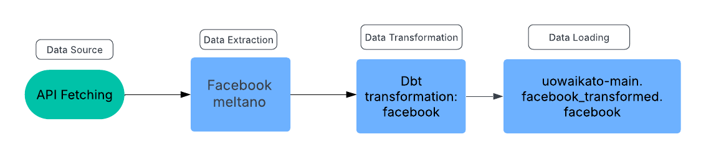

# UOW-MELATNO
## Overview: 
### Uowaikato-main is an ELT project consists of different meltano pipelines on data from cm360, the trade desk, dv360,ga4,tiktok,snapchat,google ads and linkedin for University of Waitako. 

## Execution:
### The following commnad runs the EL process, the extractor and loader name can be found on meltano.yml.
```
meltano run extractor_name loader_name
```
### example:
```
meltano run tap-facebook target-bigquery
```
### The following command runs the transformation process.
```
meltano invoke transformer_name run --select dbt_model_name
```
### example:
```
meltano invoke dbt-bigquery run --select facebook.sql
```
## Structure:
### The following diagram shows the the pipeline structure for different data sources
### DV 360

### Google Ads Display

### Snapchat Ads

### Tiktok

### CM 360

### The Trade Desk 

### Google Analytics 4

### Facebook

### Linkedin
![Linkedin Pipeline]